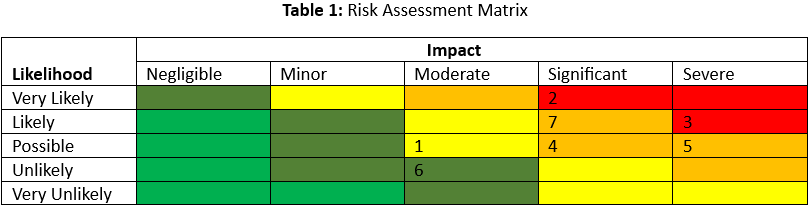
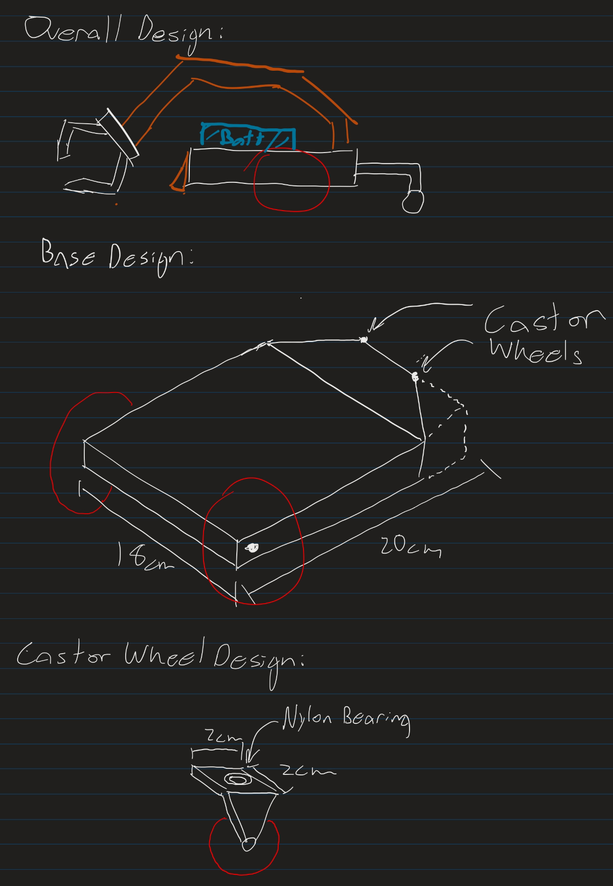
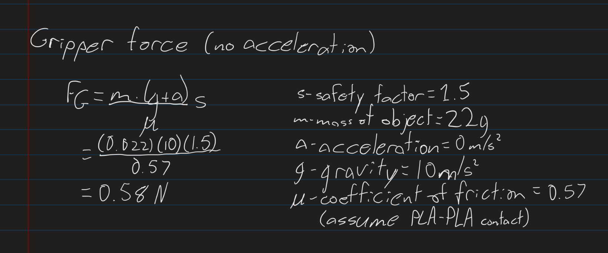

# MREN 303 W2024 Design Competition
### Dino Rescue
### Section_002_Group03_Dino_Rescue
### By: Ahmed Iqbal & Thomas Wilkinsion
## 2.1 - Top Three Ideas for Design

3. X-Y Linear Motion System with Z-axis Crane

 Idea is to build a structure around the enclosure which has X-Y motion. Using a crane, dinosaurs and doll can be picked and dropped.

    Pros:

        •   Simpler motion as a result of being fixed

        •   Highly accurate

    Cons:

        •   Requires significant materials

        •   Needs to be built around enclosure

2. Large Arm-manipulator Robot

Use an arm manipulator robot which can reach the entire enclosure, similar to the idea above. 

    Pros:

        •   Fast, efficient motion

        •   Highly accurate

    Cons:

        •   Significantly more complex, requires many materials

        •   Needs to be built around enclosure

 1. Mobile Base with arm-manipulator Robot

 Using a mobile base with an arm manipulator on top which can reach for the dinosaurs and doll. Mobile base can drive around the enclosure to collect said objects.

    Pros:

        •   Possible with materials provided

        •   Significantly more freedom of motion

    Cons:

        •   Slower than other ideas

        •   Merges two design ideas, may get complicated.

## 2.2 - Overarching Design Problem
The goal of this competition is to design a robotic system that will autonomously navigate a gate, corral all the dinosaurs into a cage, and to bring the doll to the helipad. The scoring is based on the robot’s ability to complete each task, and the amount of time taken to complete them. Some tasks, such as the autonomous mode enable double points by using the push button to open the gates. The doll rescue must also stay within a certain acceleration rate, as the points are scaled to the accelerometer. This must all be done with only the materials provided by the course instructor and any material they may permit.

Below is a breakdown of the scoring structure. Dino Rescue will aim to maximize 
points by achieving all the tasks in a short amount of time.

Based on the ruleset as well as the physical layout of the enclosure, Dino Rescue has decided to set the design direction to be a mobile robot solution. This will utilize a mobile base, in which the system will navigate and orient the robot, and a robotic arm with a gripper to manipulate and grab the environment. 

### Sub-objectives
•	Design a mobile base and robotic arm. Although designs are being explored, a differential drive with a castor wheel presents a great solution for our requirements. The robotic arm needs further research into different solutions before a design direction is chosen. 

•	For the autonomous section, the team will aim to hit the button. Given that this presents more challenges than the line following, the team will have to spend some time to ensure that the robot can press the button consistently. 

### Constraints

Some of the constraints on the kit components include:

•	Only use the actuators provided by the kit.

•	Limited to 11 in3 volume of 3D prints.

•	Limited to two 1/8” MDF Panel with dimensions of 23.5" x 11.75"

## 4.1 - Design Round 1 Scrum Planning
The specific goal of this round is to set up the Raspberry Pi Pico W and achieving wireless communications between the Pico W and a host computer to connect the Logitech F310 Gamepad. This includes configuring the microcontroller to the network and connecting the host computer through an IP address. By running both programs and monitoring the serial monitors, the controller inputs are being registered by the Pico W. 

The teams’ goals for this design review are to get a concept on the direction in which the design will take. After researching and reviewing different options, the design will be based around a mobile robot with a robotic arm. This design provides the actuation and mobility needed to achieve the tasks. The next goals regarding this will be around the specific designs of the robotic arm and mobile robot. 

### Tasks
Determining which materials and components are allocated to the different parts of the design. For example, our preliminary concepts use the two DC motors in the base, configured for differential drive. The three servos are allocated to the arm, providing enough actuation for the robotic arm to operate.

Identifying challenges with the enclosure. An apparent issue is the position of the doll, being in the pit. The design of the robotic arm should be able to reach into the pit and will be considered in the design. 

Research different mobile solutions for the robot, looking at the advantages and disadvantages of each solution. This is also the case for the robotic arm. 

### Responsibilities
Given that it is early in the design process, the team will work together to complete the tasks, as to ensure that the design direction is on the same page. As the project goes on, each member will focus on a different portion of the design, likely to be split between the mobile base and the robotic arm.

## 4.2 Health and Safety Considerations
General safety considerations include the location of exits, fire alarms, and fire extinguishers, as well as the development of emergency evacuation procedures. To mitigate the risks associated with fire hazards it is crucial that the workspace is equipped with clearly marked exits, fire alarms, and fire extinguishers. Additionally, everyone entering the building for the first time should be forced to attend a mandatory safety training informing them of the emergency evacuation procedure as well as the locations of emergency exits, fire alarms, and fire extinguishers. 

Component safety considerations include power sources such as batteries and wall outlets, the fabrication equipment, and the electronics for the robot. To mitigate the risks associated with power sources it is crucial that team members charge the batteries after every use and monitor them to make sure they are not damaged. It is also important that team members are cautious around all electrical sources, particularly those with high power ratings such as wall outlets. To mitigate the risks associated with fabrication equipment it is important that proper safety procedures are followed, such as wearing safety goggles, gloves, and masks while cutting equipment. To mitigate the risks associated with the electronics it is important the team members avoid making short circuits, follow pre-planned schematics, and wear proper equipment while soldering such as gloves and safety glasses.

## 4.3 Risk Management

1.	Robot gets stuck. (Possible and Moderate)

    It is possible that objects get underneath the robot while it is driving, it is also possible that objects get caught in the clamp. To mitigate this risk the team has decided to add a shovel on one end of the robot so that no objects can make their way underneath it and get it stuck in place. Additionally, the team is planning on designing a clamp that the dinosaurs and the doll can’t get caught on. Ahmed will oversee the design of the clamp.

2.	Difficulties getting robot to push button in time by the final deadline. (Very Likely and Significant Impact)

    Since the task of getting the robot to successfully push the button involves many uncertainties and since none of the team members have accomplished it before, it is very likely that the team may not be able to incorporate it in their final design in time. To mitigate this risk the team plans on having a fall-back plan which is to first get the robot to successfully line-follow and then try to hard code it to go and push the button. If the team is not satisfied with the robot’s ability to push the button by the final deadline, they will choose to go forward using only the line following. Thomas will monitor weather the team can properly achieve the push button method in time.

3.	Stretched Resources. (Likely and Severe)

    The team is only allocated 11 cubic inches of 3D printing material and two 23.5x11.75 inches MDF panels. Therefore, it is likely that the team runs out of material before completing the robot. To avoid this risk the team plans on formulating a well-planned design to use the least amount of material as possible. Additionally, the team plans on making a design that leaves additional material to spare in case issues occur. Ahmed will monitor the use of material. 

4.	Electrical wiring (Possible and Significant)

    Since the team will be connecting multiple electrical components together there will need to be a lot of connections on the breadboard at once, making it tricky to get all of them right. Therefore, there is a possibility that a team member, makes a mistake while wiring the components together. To mitigate this risk the team plans on making a pre-planned wiring schematic to easily follow while wiring the components together. Thomas will oversee the wiring schematic and make sure the electrical components are wired correctly.

5.	Component breaks. (Possible and Severe)

    The team is only given a fixed number of components and will likely need to use most of them for their design. It is possible that one or more of the components break, if that were the case, the team may not be able to complete their design. To mitigate this risk the team plans on using the method discussed in “Electrical wiring” to make sure components are wired properly together avoiding any short circuits. Additionally, the team plans on handling the components with care and only plan on using them once they are set up to work with the overall robot, this will reduce their wear. Ahmed will monitor the use of the components.

6.	Team members have different schedules. (Unlikely and Moderate)

    Since both team members have busy schedules there is a possibility that they won’t find much time to work together on the project outside of class times, this would reduce the overall quality of the final design. To mitigate this risk the team plans on setting up specific meeting times every week to make sure that team members always stay on the same page and have a clear idea about their roles in the project. Thomas will oversee the team meetings.

7.	Design objectives. (Likely and Significant)

    Since this is a large design project and both team-mates are very busy outside of the project it is likely that the team will not complete certain tasks in time. To mitigate this risk the team plans on having a clear plan on when they want certain tasks to be completed throughout the semester. The team will look over the plan during every group meeting to ensure they are staying on schedule. Ahmed will oversee making sure the team meets all its deadlines on schedule.

By analyzing the risk assessment matrix in Table 1 it is clear to see that risks 2 and 3 should be prioritized first followed by 7, 5, and 4.

## 4.4 Design On Paper
 1. Are you happy with these ideas?

    These ideas present a good potential in design direction. Given this, many of the ideas, such as the X-Y linear motion and manipulator present themselves as requiring significantly more material than provided, and would be harder to impliment. The mobile robot is great as it provides a middle ground for speed, agility and would likely stay within the material requirements.

 2. Instinct - is there an idea that you want to try based on your creative instincts and desire to learn?

    The mobile robot would be a good design in terms of creative instincts and desire to learn given that it combines two robotic technologies into one robot. The challenges it present are also more interesting to the team. 

3.  Analytical - is there an idea that you know from previous courses or your past experience that should work?

    The team has worked with previous mobile robot solutions, including the MiniBot and 4WD Rover. Both are different applications but use the same underlying concept of differential drive. The MiniBot used a castor wheel, allowing it to have a short turning radius, and our design will encapsulate that. 

 4. Are your ideas all high risk, low risk, or a combination of the two?

    The mobile robot is both high and low risk given that the design is more complex but easier to implement. The other ideas are higher risk as the material amount would most likely happen. 

5. Choose one of the ideas to explore further. Does the chosen idea have prior art? What has been done that is similar to your idea? What are some of their shortcomings? What do you proposed to do differently, if anything?

    The team has chosen the mobile robot solution. The idea of having a mobile base with an actuating arm has been used in many applications, such as an EOD robot. These are used for bomb defusal and disposal, utilizing a differential drive with an arm-manipulator. Although there are different designs, most use tank tracks with actuating extension, as to climb stairs and difficult terrain. The team does not plan to use this, rather using wheels and a castor for motion. One shortcoming of this is the weight, and since the robot cannot be tethered the weight must be kept to a minimum.  

6. You will be performing back-of-the-envelope analysis in this workshop and building a cardboard pro-totype in the next workshop. Within your design idea, focus on a potential mechanism (or module, to be discussed in lecture), such as a hinge joint on an arm to pick up a dinosaur.

7. What are some open questions for your mechanism? Perform a back-of-the-envelope calculation to arrive at an educated guess for one of your questions. Some examples include calculating torque, range of motion, or speed.

How much grip force is needed to lift the dinosaurs?
Grip Force of robotic gripper:

Based on: https://en.iprworldwide.com/calculation-of-gripping-force/

PLA-PLA friction coefficient: https://www.emerald.com/insight/content/doi/10.1108/RPJ-03-2022-0081/full/html

## 5.3 Documentation

The team intends to prototype a mobile base, with the castor wheels. This will hopefully give us a good idea on physical sizing and amount of area for the arm-manipulator.

