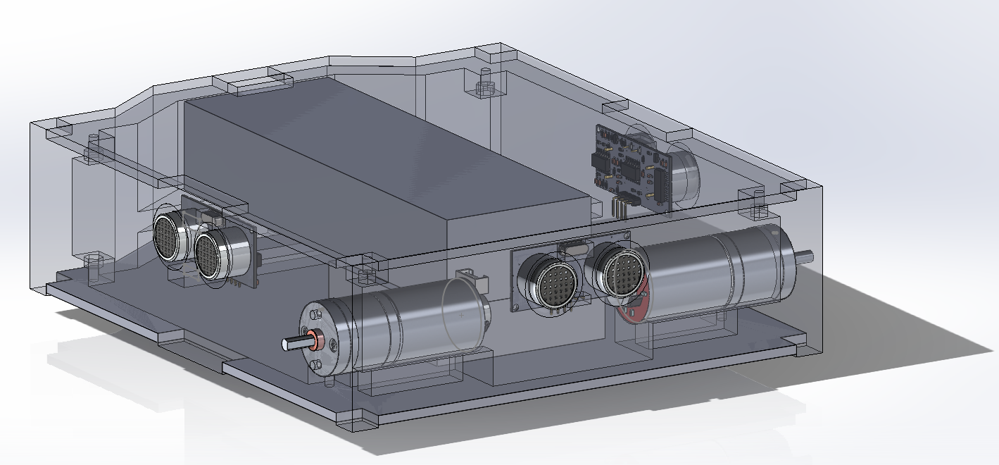
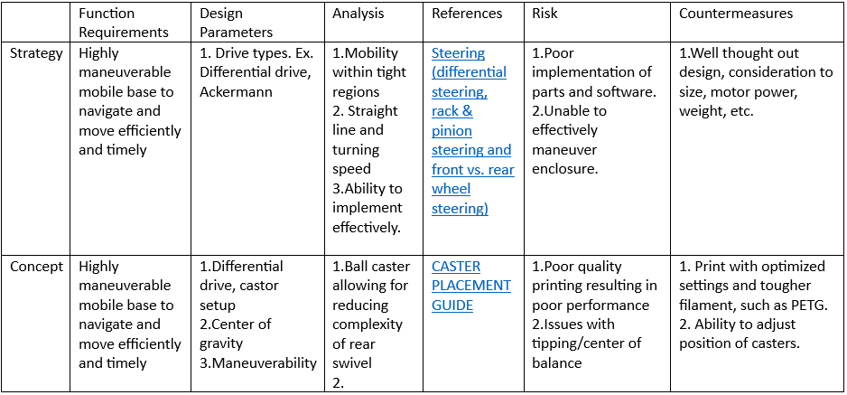
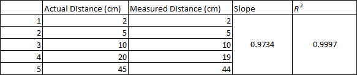
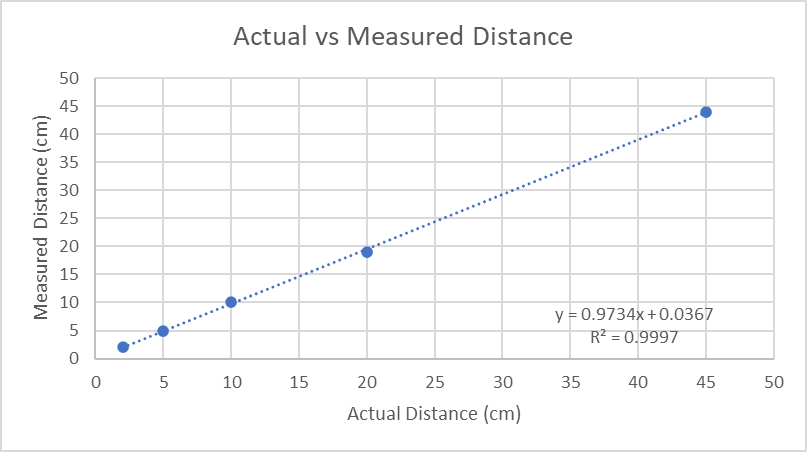

# MREN 303 W2024 Design Competition - Round 2 Documentation
### Dino Rescue
### Section_002_Group03_Dino_Rescue
### By: Ahmed Iqbal & Thomas Wilkinsion

## 2.5.1 - Cardboard Prototype Update
The Cardboard prototype set out to provide a sense of physical sizing and visualization for the final design. It gave the team a better understanding of the challenges and problems that may arise because of size. One consideration that came from the prototype is the robot’s ability to autonomously travel to the button, and then get through the gate. Given a base width of 18 centimetres, there will be about 3-4 cm of distance between the walls of the gate, which gives the autonomous system a small margin of error. Based on these insights, decreasing the width of the robot will help give a larger margin of error through the gate.  

## 2.5.2 - Design Round 2 SCRUM Planning 
The goal for this round is to have the rest of the sensors and components working with the Pico W. This includes the ultrasonic sensor, servo, and motors. Another goal for this round is making FRDPARRC table to better plan out the design and development of the Dino Rescue Bot. The teams’ goals for this round are to start the CAD model for the mobile base to be ready to print in the coming week. 

Currently, the robotic arm and claw are on backlog, and the team will make progress on these items once the base is complete. 

Tasks needed to achieve each goal:

•	Finishing CAD model of the mobile base.

        - Determine final position of all components for optimal storage and center of gravity.
        -Find the best position for the robotic arm for good reach while maintaining stability. 

Current progess of mobile base:

•	Start CAD model of robotic arm and claw.

        - Determine the specific requirements for the actuation and grabbing mechanism. 
        - Use software like Linkage to determine kinematics of system.
        - Create CAD model to print, with consideration of servo sizing. 

## 2.5.3 - Health and Safety Considerations Update

After reviewing the health and safety plan from round 1 the team has decided to add a couple more safety considerations. For starters, the team used sharp objects such as utility knives and scissors while cutting the cardboard during the prototyping stage. These objects obviously pose large safety risks. To mitigate these risks the team plans on always managing the knives and scissors with caution and plans to always close the knives back into their sheaths when they are not being used. An additional consideration that was not mentioned in round 1 was the possible occurrence of a sick team member. To mitigate the risk of spreading viruses, the team plans to have teammates stay home if they show any symptoms of sickness. As of now the team is proud to state that all aspects of the plan have been met. For example, the knives and the electronics have been handled with caution and Ahmed stayed home today (Feb 05) since he was feeling sick.

## 2.5.5 - FRDPARRC Table

Sources:

https://mae.ufl.edu/designlab/class%20projects/background%20information/steering.htm

https://mytonindustries.com/index.php/caster-placement/

## 3.3.2 - Ultrasonic Sensor Data and Calibration

The ultrasonic sensor was tested at ranges of 2cm to 45 cm. Within this range, the sensor shows accurate performance, being within 97% of the actual distance. This could see improvement, but is a low priority task for now. The maximum range was chosen to be 45 cm as this is the longest ranges the robot be around when inside the enclosure. 

### Sources:
https://www.industrialwheels.com/en/castor-wiki/wheel-configuration/

https://grabcad.com/library/ball-caster-mount-lego-compatible-1

https://grabcad.com/library/pololu-ball-caster-with-3-8-plastic-metal-ball-1/details?folder_id=3553271
https://grabcad.com/library/dc-motor-with-encoder-1

https://grabcad.com/library/hc-sr04-ultrasonic-sensor-8

https://youtu.be/dTGITLnYAY0?si=oe1-L1JPMZFxVg1R

https://www.industrialwheels.com/en/castor-wiki/wheel-configuration/

https://grabcad.com/library/ball-caster-mount-lego-compatible-1

https://grabcad.com/library/pololu-ball-caster-with-3-8-plastic-metal-ball-1/

https://grabcad.com/library/dc-motor-with-encoder-1

DC motor Arduino code:

https://youtu.be/dTGITLnYAY0?si=oe1-L1JPMZFxVg1R
