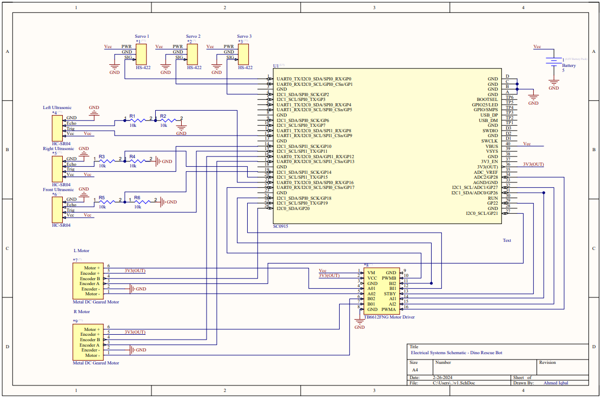
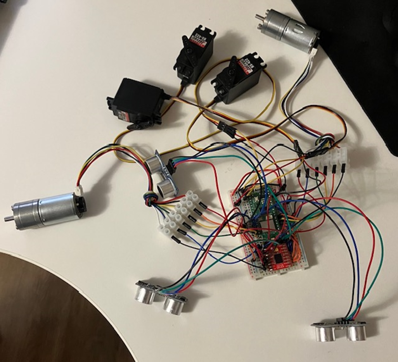
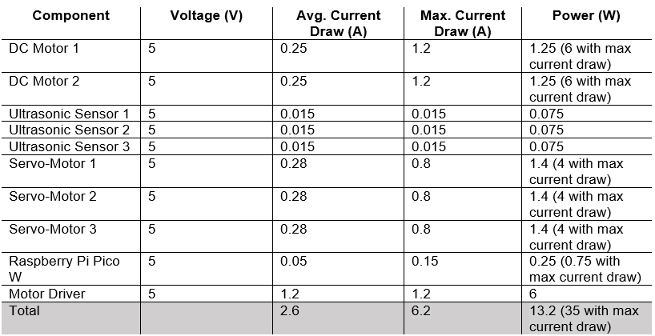
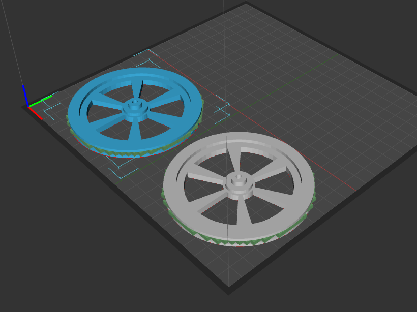
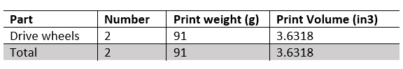

## 2.5.1 - Design Round 3 SCRUM Planning 
The goal for this round is to 3D print and laser cut important components such as the drive wheels and base. The first version of the base had been finished and ready to print. However, after clarification with the TAs regarding the print volume, the base required a redesign. Instead, it will be created out of MDF board, using finger slots to construct it into a base. The electrical system is finished, with all components wired and programmed into the microcontroller. The goal with the electrical system is to install it into the base and begin integration.

Currently, the robotic arm and claw design and implementation are on backlog. However, this item should be finished by the end of the week, and the team will be on schedule. The team is printing some omni-wheels for the rear, which should be finished by the end of the week.

Tasks needed to achieve each goal:

Wire Electrical System 
    
    Include all components, wired to the smaller breadboard.
        - Task Completed – Thomas

    Create electrical systems schematic.
	    - Task Completed – Ahmed

3D print Components

    Design & Print wheels.
    	- Task Completed – Ahmed

    Design & Print omni wheels.
        - Task In Progress - Ahmed

Laser Cut CAD model of the mobile base.

    Finalize changes to the cuts.
        - Task in Progress – Ahmed

Finish CAD model of robotic arm and claw.

    Double check conceptual design, make changes if necessary.
	    - Task in Progress – Ahmed & Thomas

## 2.5.2 - Electrical Schematic and Power Budget 
The electrical system of the Dino Rescue Bot is based around the Pico W. All the provided electronic components are used. Power is supplied by the battery 4-cell battery pack. 

The electrical schematic is shown below. 

The electrical system has been wired, and should see minimal changes from this state.

The power budget is calculated with the sources provided below.

Capacity for once AA Duracell at full charge is 2.5 Ah. With 4 AA Duracell’s, capacity at full charge becomes 10 Ah.

With nominal power draw: 10 Ah / 2.6 A = 3.85 hours of use

With worst case scenario (Max. power draw): 10 Ah / 6.2 A = 1.6 hours of use 

### Sources:
Servo: https://hitecrcd.com/products/servos/analog/sport-2/hs-422/product

Motor Driver: https://www.sparkfun.com/products/14450

Pi: https://lastminuteengineers.com/getting-started-with-raspberry-pi-pico-w/#:~:text=With%20WiFi%20turned%20on%2C%20the,an%20external%20trigger%20to%20wake.

DC Motor: https://ca.robotshop.com/products/6v-dc-motor-10kg-cm-210rpm-encoder

Batteries:https://www.digikey.ca/en/products/detail/duracell-industrial-operations,-inc./AA-NIMH-DURACELL/16164081?utm_adgroup=&utm_source=google&utm_medium=cpc&utm_campaign=PMax%20Product_Low%20ROAS%20Categories&utm_term=&productid=16164081&utm_content=&utm_id=go_cmp-20291741422_adg-_ad-__dev-c_ext-_prd-16164081_sig-CjwKCAiAivGuBhBEEiwAWiFmYZki6q1jBXV7B23mas8TYVF_uDfNG3f4HilnPhZQhIXqkFcM1bHh6BoCLIEQAvD_BwE&gad_source=1&gclid=CjwKCAiAivGuBhBEEiwAWiFmYZki6q1jBXV7B23mas8TYVF_uDfNG3f4HilnPhZQhIXqkFcM1bHh6BoCLIEQAvD_BwE

## 2.5.3 - Component Fabrication

The team printed the drive wheels, measuring 96mm in diameter. The part was designed in SolidWorks CAD, with the limited volume in mind. The face is flat, and is printed directly onto the bed to reduce support waste. Below is an image of the CAD models. 

## 2.5.4 - Print Volume
The print volume will be tracked in a table, to be upadted whenever a print is done. 

## 3.2 - Mechanical Module 
The team has printed the drive wheels, as shown below. The wheels have a groove in the middle to help keep the rubber tread in place. 

The base is ready to be cut by the laser cutter in the ILC.

## 4.2 - Team Health Assessment and Peer Feedback
After going over the topics discussed in the lecture, team members realized that they need to give more critical feedback. So far, the team has been giving supportive and positive reviews, which is a good thing. However, there is always room for improvement and team members need to point out each other’s weaknesses through constructive feedback. By doing so, the team will be further strengthened.