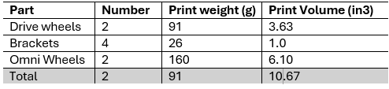

## 2.4.1 - Design Round 4 SCRUM Planning 
The goal for this round is to integrate the modules together to get the mobile base to move around. All the 3D printed parts around the mobility have been printed, and the body has been cut out of the MDF. The drive wheels were printed last week, and the omni wheels have been printed as well. The electrical system is integrated with the new wheels, and the code has been updated to allow for manual control with the controller. The next goals are to fine-tune the controls and implement an autonomous mode. 

The robotic arm and claw design and implementation are still on backlog. Other items have taken a considerable amount of time, roughly two weeks extra, and must be pushed further back. However, as the mobile base approaches its completion, there should more time to spend on the arm. 

Tasks needed to achieve each goal:

Wire Electrical System
-	Completed

3D printed components
-	All drive components printed. 
-	All brackets printed
-	Designing and printing robotic arm & claw parts - Ahmed & Thomas 

Laser Cut components.
-	Body completed, just top plate which will be done with the arm.
-	Arm parts still being designed - Thomas

## 2.4.3 - Work Plan Reflection
Overall, the team is happy with the progress and design that the project has taken so far. We are behind in terms of the timeline, as we wanted to integrate during week 6 & 7. However, we were uncertain about some design elements to implement, such as using omni-wheels over caster for the rear wheels, and this made the mechanical design aspect longer to make. Even with this, the team is still able to meet the key deliverables and milestones. On top of this, the main body required a redesign to be made from MDF board. Now that the mobile base is done, progress on the rest of the items should be done on schedule. 

The team is seeing a relatively fair workload distribution. Both members have most of their focus on one aspect of the robot, and we can meet to integrate. The team is within budget and has material to spare. We requested for paper clips for our rear wheels and was granted by the TA. 

## 2.4.4 - Module Integration Reflection 
The module integration went relatively smoothly, with everything fitting together and implemented well. However, there was an oversight on the front plate, and was accidentally installed on the rear. The team will move forward with this as we think this can provide us a greater advantage, compared to installing at the front. In the next iteration, the team will see how the autonomy system responds with the ‘front’ sensor installed to the rear. 

## 3.4.2 - 3D Print Tally

## 3.4.3 - Design for Sustainability
The current design process reflects a ‘measure twice, cut once’ approach, where the design was well thought out before, and then designed with real components, reducing waste and cost. The 3D printed parts were also designed to minimize support material and have flat features to be flat on the print bed. This reduces waste material drastically. Given this, it is a slower process and energy consuming, but can be minimized by printing everything on one bed, at once. Producing the parts in-house also reduce carbon emissions as there is no associated shipping emission to bring the parts in. 

## 4.3.1 - Team Dynamics & Peer Feedback

So far, the team has worked very well together. We are able to complement each others workstyles, and communicate well enough to get work done. Peer feedback has provided great insights into what the each member is doing well, as well as places of improvement.

## 4.3.2 - Current Robot Prototype

## 5.2 Initial Impression of Robot
The team is happy with the current progress of the robot. The main concern with the design is weight, as the arm still needs to be added. The team may look into reducing the weight, potentially implimenting speed holes in the walls. 

