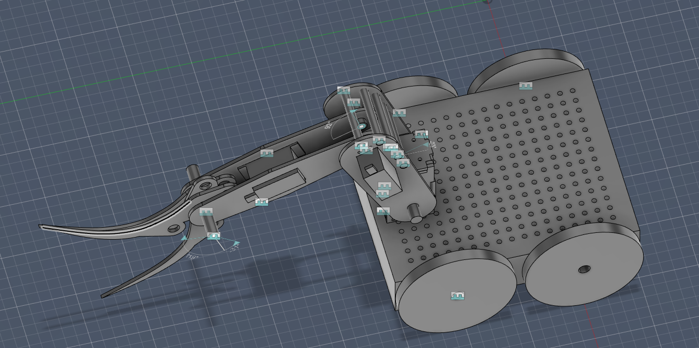
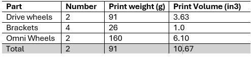

# Round 5 Documentation
## Overall Strategy
•	Autonomous Mode: button pushing using ultrasonic distance sensors and magnetic encoders

•	Manual Mode
1. Collect dinosaurs (first priority)
2. Rescue Ken (second priority)

## 2.3.1 - Design Round 5 SCRUM Planning
The goals for this round are to finalize the robotic arm and autonomous system. All parts made of MDF are cut and are being assembled. The robotic arm still requires a bit of assembly and then adjustment to work in an appropriate manner. The autonomous system is nearing completion as well, with the path hardcoded onto the Pico. The current autonomous system was made without the arm, so the system may require some tuning and adjustment to get it working with full function. 

There are no more backlog items, all tasks have been completed and the team is down to the final steps.

Tasks:

•	Complete robotic arm

- Finish assembly.

- Do adjustments.
- Finalize code tuning.
- Ahmed & Thomas

•	Finish autonomous system.

- Retest with robotic arm.
- Make adjustments to autonomous system. 
- Ahmed & Thomas

## 2.3.3 - Team's Initial Thoughts
Overall, the team is happy with the mobile robot. The base is very sturdy and holds the weight of the components without an issue. As such, the top brackets for the top plate will not be printed. The robot design has many unique elements, such the omni-wheels, and helps differentiate the robot from the competition. In the next iteration, the team will try to improve the base design, decreasing the dimensions for better mobility.

## 3.2.1 - Design Files

## 3.2.2 - 3D Print Tally

## 4.1.2 - Team Picture

## 4.2.2 - Team Health Assessment and Peer Feedback
The team discussed the gap in emphasizing high standards, and we mainly saw it as an unknowing of our expectations. Although we have a good idea on our design direction and approach, we realized that we were not specific enough on what is an acceptable design. This does not have a big impact on the final product as our designs are more than capable of the goals needed, but does impact our efficiency in material use and design time. 

